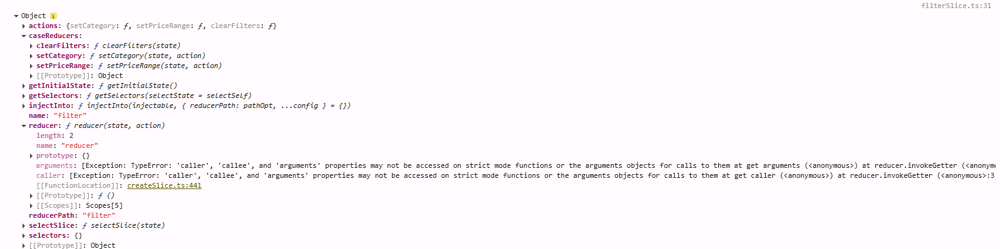

# Redux Toolkit (RTK)
- Redux는 애플리케이션 상태(state)를 관리하기 위한 라이브러리지만, 전통적으로 설정과 코드가 복잡 -> RTK는 이런 여러움을 한방에 해결해주는 도구
- 모든 components가 props 없이 state 공유 가능. 

## 기존 Redux를 쓸 때 자주 등장하던 문제들
- 스토어 설정이 복잡하고 미들웨어, DevTools 등 여러 패키지를 연결해야 함.
- 반복적이고 많은 보일러플레이트 코드 (action, action creator, reducer 작성 등) 
- 비동기 로직 작성이 까다로움, 별도 설정이 필요

<br/>

# 설치
1. Redux 설치
```bash
npm install @reduxjs/toolkit react-redux
```

# 용어 정리
| 용어                     | 역할                                |
| ---------------------- | --------------------------------- |
| State                  | 현재 상태 **객체**                          |
| Action                 | 상태 변경 요청 **객체**                       |
| Action Creator         | Action을 생성하는 **함수**                   |
| Reducer                | Action 기반으로 상태 업데이트하는 **함수**          |
| Case Reducer           | 특정 Action 유형에서 상태를 변경하는 부분        |
| Slice                  | 상태·액션·리듀서 코드가 한 묶음으로 구성된 **단위**       |
| createSlice({})        | Slice를 정의하고 자동 생성해주는 **함수**           |
| Store                  | Redux 상태 **저장소**                      |
| configureStore({})     | store를 쉽게 구성해주는 **함수**                |
| Middleware             | dispatch와 reducer 사이에서 동작하는 추가 기능 |
| RootState, AppDispatch | TypeScript에서 state, dispatch의 타입  |
| Provider               | React에 store를 제공하는 컴포넌트           |

<br/>

# 전체 흐름 요약
```
UI 클릭
↓ 
dispatch(setCategory(['Food'])) 
↓
action creator
↓
Action 객체 생성 
↓
store.dispatch()
↓
store가 action과 state를 reducer에 전달 
↓
새로운 state 계산 
↓
UI 자동 렌더링
```

<br/>

# 파일 구조
```
mymc-portfolio
├── 📁 app                             # Next.js 에서 사용되는 라우터 폴터
│   ├── 📄 layout.tsx                  # Redux 적용 범위 설정                  
│   └── 📄 StoreProvider.tsx           # 클라이언트 전용 스토어 프로바이더         
│
├── 📁 redux                           # 상태(Redux) 중심 로직을 한 곳에 모음
│   ├── 📁 features                    # 필터, 정렬 등의 slice 파일
│   │   └── 📄 filterSlice.ts                  
│   ├── 📄 hooks.ts                    # 타입선언을 위해서 커스텀 훅 생성
│   └── 📄 store.ts                    # 저장소         
```

<br/>

# 예시 코드
## 1. state 저장소 구성: `store.ts`
- `store.ts`: 모든 state가 저장되는 `저장소`
```js
// redux/store.ts
import { configureStore } from '@reduxjs/toolkit';
import filterReducer from '@/redux/features/filterSlice'; // '이름Reducer' 형태로 별명 붙임

export const store = configureStore({
  reducer: {
    filter: filterReducer,
    // ... 더 추가 가능
  }
});

export type RootState = ReturnType<typeof store.getState>;
export type AppDispatch = typeof store.dispatch;
```

## 2. 타입 지원 커스텀 hooks: `hooks.ts`
- Redux Toolkit + React + TypeScript 환경에서 typed hooks를 선언
- 프로젝트의 모든 컴포넌트에서 손쉽고 안정적으로 Redux 기능을 사용할 수 있게 해줌.

```js
import { TypedUseSelectorHook, useDispatch, useSelector } from 'react-redux';
import type { RootState, AppDispatch } from './store';

export const useAppDispatch = () => useDispatch<AppDispatch>();
export const useAppSelector: TypedUseSelectorHook<RootState> = useSelector;
```

## 3. state를 관리 객체 생성: `slice.ts`
- 전통 Redux에서는 action, actionCreator, reducer를 따로 만드느라 코드가 길었지만, RTK에서는 createSlice() 한 줄로 모두 해결

```js
// redux/features/filterSlice.ts
import { createSlice, PayloadAction } from '@reduxjs/toolkit';

interface FilterState {
  category: string[];
  priceRange: [number, number] | null;
}
const initialState: FilterState = {
  category: [],
  priceRange: null,
};

// 자세한 내용은 코드 아래 참고
const filterSlice = createSlice({
  name: 'filter',
  initialState,
  reducers: {
    setCategory(state, action: PayloadAction<string[]>) {
      state.category = action.payload;
    },
    setPriceRange(state, action: PayloadAction<[number, number] | null>) {
      state.priceRange = action.payload;
    },
    clearFilters(state) {
      state.category = [];
      state.priceRange = null;
    },
  },
});

// filterSlice.actions: RTK가 자동 생성한 action creator 함수 모음
// dispatch(...)를 호출하려면 action creator 함수가 필요. 만약 slice.reducer만 export된다면, store에는 reducer는 들어가지만 컴포넌트에서는 어떤 action을 보내야 하는지 몰라서 상태 업데이트를 할 수 없음.
export const { setCategory, setPriceRange, clearFilters } = filterSlice.actions;

// filterSlice.reducer: store에 연결되어 상태 변경 로직을 수행하는 `최종 리듀서`
// 이 함수는 store에 연결되어, 전달된 action을 기반으로 state를 실제로 업데이트
export default filterSlice.reducer;
```
<br/>

<br/>
<br/>

- `createSlice({ })`: Slice 를 만들어주는 함수
  - Slice: RTK(Redux Toolkit) 에서 소개한 개념으로, 애플리케이션 상태를 기능 단위로 쪼갠 조각/단위 ex. filter, use, cart 같은 기능별 상태 덩어리
  - createSlice({ })를 실행하면, RTK는 이를 바탕으로 자동으로 'name, initialState, reducers, extraReducers, reducerPath, selectors' 을 담고 있는 객체를 생성
- `createSlice.name`: 
  - **타입**: `string`
  - **역할**: slice의 이름을 지정. 생성된 action type prefix로 사용됨 (예: "filter/setCategory").
- `createSlice.initialState`:   
  - **타입**: 원하는 상태 구조(State타입)
  - **역할**: 리듀서의 시작 상태
    - undefined 상태가 들어올 때 이 값을 사용
    - 함수 형태로도 작성 가능, 예: {count: 0} 또는 () => ({ count: 0 })를 리턴
- `createSlice.actions`: 
  - **타입**: { actionCreator1(함수1), actionCreator2(함수2), ... }
  - **역할**: 
    -  각 reducers에 대응하는 **action creator 함수들이 모여 있는 객체**
      - **action creator**: [*createdSlice*].actions.[*actionCreator1*]: 여기서의 action creator는 'setCategory(), setPriceRane(), clearFilters()'에 해당
      - **action type**: [*createdSlice*].actions.[*actionCreator1*].type: 각각의 action creator는 문자열 타입의 type 속성을 가지고 있음. 어떤 종류의 action인지 식별하는 **고유 식별자** 역할. Redux에서는 type필드로 어떤 reducer가 이 Action을 처리할지 구분. ex) filer/setCategory, (sliceName/caseReducerName) 형태로 자동 저장
    - 때문에 export할때는 createdSlice.reducers가 아니라, createdSlice.actions를 써서 함수 export해줘야 함
- `createSlice.reducers`:   
  - **타입**: `{ [key: string]: ReducerFunction | ReducerAndPrepareObject }`
  - **역할**: 
    - case reducer 함수 모음
      - case reducer: 특정 action타입에 대응하는 state 업데이트 로직 **함수**, action이 발생했을 때 상태를 어떻게 바꾸는지 case단위로 정의. 여기서는 setCategory(), setPriceRane(), clearFilters()가 해당
    - reducer는 Redux스토어의 상태를 계속 업데이트 하는 통합 함수 (reducers에서 정의한 여러 로직들을 케이스 별로 처리할 수 있도록 하나로 합쳐놓은 단 하나의 **최종 리듀서 함수**로 내부적으로는 **switch 구문처럼 동작** => 스토어에서 상태 변경을 담당)
    - 각 함수는 (state, action) 형태이고, 로직 실행 시 state를 직접 수정하는 것처럼 작성하지만, 내부적으로는 불변성(i.e., Immer)이 보장
    - key 이름은 action creator 이름이 되며, slice.actions[thatName] 형태로 접근 가능
- `createSlice.caseReducers`                                    
  - **역할**: 원래 정의한 reducers 함수들 원본
- `createSlice.extraReducers`
  - **타입**:
    - 콜백 방식: (builder) => void
    - 또는 객체 형태 { [actionType]: caseReducer }
  - **역할**:
    - 이 slice에서 정의하지 않은 외부 action type을 처리할 때 사용.
    - createAsyncThunk로 생성된 action(pending/fulfilled/rejected 등) 처리에 주로 사용
- 그 외: reducerPath, selectors
  - **reducerPath**: slice의 경로를 지정하며, 주로 RTK Query에서 사용됩니다. 기본값은 name과 동일합니다.
  - **selectors**: slice 상태를 쉽게 조회하기 위한 selector 함수를 미리 정의해 줄 수 있음


## 4. Redux Provider 래퍼 생성: `StoreProvider.tsx`
- 모든 곳에서 Redux 의 상태 값 호출 가능하도록 커스텀 Provider 컴포넌트 생성
- 상태 관리 관련된 컴포넌트는 CSR (Client Side Redering)이므로 항상 `use client` 붙여야 함.

```js
// app/StoreProvider.tsx
'use client';
import { Provider } from 'react-redux';
import { store } from '../redux/store';
import { ReactNode } from 'react';

export default function StoreProvider({ children }: { children: ReactNode }) {
  return <Provider store={store}>{children}</Provider>;
}
```

## 5. Provider 연결: `layout.tsx`
- Provider wrapper 로 감싸서 페이지 전체에서 Redux상태를 사용할 수 있도록 만들기

```js
// app/layout.tsx
import StoreProvider from './StoreProvider';
exp
ort default function RootLayout({ children }: { children: React.ReactNode }) {
  return (
    <html>
      <body>
        <StoreProvider>{children}</StoreProvider>
      </body>
    </html>
  );
}
```

## 6. 컴포넌트에서 redux 사용
```js
'use client';
import { useAppSelector, useAppDispatch } from '@/redux/hooks';
import { setCategory, clearFilters } from '@/redux/features/filterSlice';

const Sidebar = () => {
  const categories = useAppSelector(state => state.filter.category);
  const dispatch = useAppDispatch();

  return (
    <div>
      {['Food', 'Drink', 'Snack'].map(cat => (
        <label key={cat}>
          <input
            type="checkbox"
            checked={categories.includes(cat)}
            onChange={() => dispatch(
              categories.includes(cat)
                ? setCategory(categories.filter(c => c !== cat))
                : setCategory([...categories, cat])
            )}
          />
          {cat}
        </label>
      ))}
      <button onClick={() => dispatch(clearFilters())}>Reset</button>
    </div>
  );
};

```

------------

# 이전에 작성했던 내용
```js
(store.js)
// 1. src/store.js 생성 및 아래 코드 복붙
import { configureStore, createSlice } from '@reduxjs/toolkit'

export default configureStore({
  reducer: { 
  }
}) 

(index.js)
// 2. import
import store from './store.js'

const root = ReactDOM.createRoot(document.getElementById('root'));
root.render(
  // 3. <Provider store={store}></Provider>로 감싸기
  <Provider store={store}>
    <React.StrictMode>
      <BrowserRouter>
        <App />
      </BrowserRouter>
    </React.StrictMode>
  </Provider>
);
```

### 사용법
1. store에 단순 객체 보관 
- store에 state 보관법
```JavaScript
(store.js)
import { configureStore, createSlice } from '@reduxjs/toolkit'

// 1. createSlice() 사용해서 저장하고 싶은 state만들기. (createSlice()와 useState()가 용도비슷)
// { name : 'state이름', initialState : 'state값' }
let userName = createSlice({
  name: "userName",
  initialState: "Kim" 
})

// 2. configureStore()에 생성한 state 등록. 여기 등록한 state는 모든 컴포넌트가 자유롭게 사용가능
// { 작명 : createSlice만든거.reducer } 
export default configureStore({
  reducer: { 
    userName: userName.reducer
  }
});
```
- store에 저장된 state 사용법
```JavaScript
(Cart.js)
// 1. import useSelector()
import { useSelector } from 'react-redux';

function Cart() {
  // 2. useSelector()이용하여 store에 있는 모든 state가져옴.
  // 아래 3가지 다 동일한 결과값. 편한것으로 사용
  let {userName} = useSelector( (state)=>{ state } );
  let userName1 = useSelector( (state)=>{ return state.userName });
  let userName2 = useSelector( (state)=> state.userName );
  
  console.log(userName); // 결과값: Kim

  return(
    [생략]
  )
}
```

2. store에 함수 추가: initialState 가 object/array가 아닌경우
- store에 state 보관법
```JavaScript
(store.js)
import { configureStore, createSlice } from '@reduxjs/toolkit'

// 1. createSlice() 사용: 초기 값은 initialState에 저장하고 , 함수는 reducers :{} 안에 추가
let userName = createSlice({
  name: "userName",
  initialState: "Kim",
  reducers: {
    // 2. 추가하고 싶은 함수는 reducers에 추가, 함수 파라미터로 initialState 접근 가능
    // initialState가 object/array가 아닌 경우 state로 바로 호출
    changeName(state) {
      return "John" + state // John Kim
    },
    fun1(state){
      return 'test'
    }
  } 
})
// 3. 생성한 함수들 내보내기
export let { changeName, fun1 } = userName.actions

// 4. configureStore()에 생성한 state 등록. 여기 등록한 state는 모든 컴포넌트가 자유롭게 사용가능
// { 작명 : createSlice만든거.reducer } 
export default configureStore({
  reducer: { 
    userName : userName.reducer
  }
}) 
```
- store에 저장된 state 사용법 
```JavaScript
(Child.js)
// 1. 함수 사용하기 위해 useDispatch() 가져오기 + store에 저장된 함수 가져오기 
import { useSelector, useDispatch } from 'react-redux';
import { changeName } from '../store';

function Child() {
  let userName = useSelector( (state)=> state.userName );
  // 2. useDispatch() 선언: store.js로 요청보내주는 함수
  let dispatch = useDispatch();

  return(
    <>
      // 3. 사용: dispatch()를 통해서 changeName()호출
      <button onClick={ ()=> dispatch( changeName() ) }>변경</button>
      <p>{userName}</p> // 처음에는 Kim이고, 위에 버튼 누르면 John Kim으로 변경
    </>
  )
}
```

3. store에 변경 함수 추가: initialState 가 object/array인 경우
- store에 state 보관법
```JavaScript
(store.js)
import { configureStore, createSlice } from '@reduxjs/toolkit'

// 1. createSlice() 사용: 초기 값은 initialState에 저장하고 , 함수는 reducers :{} 안에 추가
let user = createSlice({
  name: "user",
  initialState: { name: "Kim", age: 20 },
  reducers: {
    // 2. 추가하고 싶은 함수는 reducers에 추가, 함수 파라미터로 initialState 접근 가능
    // initialState가 object/array인 경우는 state.OBJECT_KEY로 접근
    changeName(state) {
      state.name = "park" // Immer.js라는 라이브러리가 자동으로 설치가 되어서, 알아서 state 복사본을 복사해서 리턴해줌
    },
    incAge(state) {
      state.age += 1
    }
  } 
})
// 3. 생성한 함수들 내보내기
export let { changeName, incAge } = user.actions

// 4. configureStore()에 생성한 state 등록. 
export default configureStore({
  reducer: { 
    user : user.reducer
  }
}) 
```
- store에 저장된 state 사용법 
```JavaScript
(Child.js)
// 1. 함수 사용하기 위해 useDispatch() 가져오기 + store에 저장된 함수 가져오기 
import { useSelector, useDispatch } from 'react-redux';
import { incAge } from '../store';

function Child() {
  // 2. state값 가져오기 + state의 저장 함수 쓸 준비
  let user = useSelector( (state)=> state.user );
  let dispatch = useDispatch();

  return(
    <>
      // 3. 사용
      <button onClick={ ()=>dispatch(incAge()) }>나이 한살 추가</button>
      <p>{user.age}</p> // 결과 값: 20 -> 21
    </>
  )
}
```

4. store의 함수 호출 시, 파라미터로 값을 전달받고 싶은 경우
- store에 state 보관법
```JavaScript
(store.js)
import { configureStore, createSlice } from '@reduxjs/toolkit'

// 1. createSlice() 사용: 초기 값은 initialState에 저장하고 , 함수는 reducers :{} 안에 추가
let user = createSlice({
  name: "user",
  initialState: { name: "Kim", age: 20 },
  reducers: {
    // 2. 추가하고 싶은 함수는 reducers에 추가
    // state: initialState의 값, action.payload: 파라미터로 전달받은 값
    incAge(state, action) {
      state.age += action.payload
    }
  } 
})
// 3. 생성한 함수들 내보내기
export let { incAge } = user.actions

// 4. configureStore()에 생성한 state 등록
export default configureStore({
  reducer: { 
    user : user.reducer
  }
}) 
```

- store에 저장된 state 사용법 
```JavaScript
(Child.js)
// 1. 함수 사용하기 위해 useDispatch() 가져오기 + store에 저장된 함수 가져오기 
import { useSelector, useDispatch } from 'react-redux';
import { incAge } from '../store';

function Child() {
  // 2. state값 가져오기 + state의 저장 함수 쓸 준비
  let user = useSelector( (state)=> state.user );
  let dispatch = useDispatch();

  return(
    <>
      // 3. 사용: dispatch()를 통해서 changeName(PAYLOAD)호출
      <button onClick={ ()=>dispatch(incAge(5)) }>나이 5살 추가</button>
      <p>{user.age}</p> // 결과 값: 20 -> 25
    </>
  )
}
```

### Import/Export
store.js가 너무 길어져서 파일 분리하고 싶다면? => 예를들어, store.js 부분 중 user부분 분리하고 싶음.   

Step 1. src 밑에 폴더랑 파일 새로 만들기: src/store/[Slice이름]Slice.js ex) userSlice.js   
Step 2. 분리하고 싶은 코드 잘라서 새로운 파일에 붙여넣고, createSlice()등 필요한 라이브러리 import
```Javascript
(userSlice.js)
// 1. 필요한 함수들 import
import { createSlice } from "@reduxjs/toolkit"

// 2. createSlice()함수
let user = createSlice({
  name: "user",
  initialState: { name: "Kim", age: 20 },
  reducers: {
    changeName(state) {
      state.name = "park"
    },
    incAgeBy1(state) {
      state.age += 1
    },
    incAge(state, action) {
      state.age += action.payload
    }
  } 
})
// 3. 다른 곳에서 쓰기 위해서 함수(actions) export
export let { changeName, incAgeBy1, incAge } = user.actions

// 4. 다른 곳에서 쓰기 위해서 객체 export
export default user
```
Step 4. store.js에서 import
```JavaScript
(store.js)
// 1. 잘라냈던 userSlice import
import user from './store/userSlice'

[생략]

// 2. configureStore()에 저장
export default configureStore({
  reducer: { 
    user : user.reducer,
    [생략]
  }
}) 
```

Step 5. 다른곳에서 user state 쓰고 싶을 때 이전과 동일하게 사용. but, import 경로가 store.js가 아닌 [Slice이름]Slice.js임.
```JavaScript
(Child.js)
// 1. 함수 사용하기 위해 useDispatch() 가져오기 + store에 저장된 함수 가져오기 
import { useSelector, useDispatch } from 'react-redux';
import { incAge } from '../store/userSlice';

function Child() {
  // 2. state값 가져오기 + state의 저장 함수 쓸 준비
  let user = useSelector( (state)=> state.user );
  let dispatch = useDispatch();

  return(
    <>
      // 3. 사용: dispatch()를 통해서 changeName(PAYLOAD)호출
      <button onClick={ ()=>dispatch(incAge(5)) }>나이 5살 추가</button>
      <p>{user.age}</p> // 결과 값: 20 -> 25
    </>
  )
}
```

> [!Note]
> Redux store안에 모든걸 넣지는 말기! 컴포넌트간 공유가 필요없으면 그냥 useState()쓰면 되니깐.

### Redux 에서 api 호출한 결과 저장하고 싶을 때
개발하다보면 전역에서 자주 사용되는 api를 호출하거나, api 호출한 결과를 여러 군데에서 사용해야 할 상황이 생기는데, 이와 같은 비동기 처리를 redux store에서는 자체적으로 하지 못함.   
=> Redux를 사용할 때는 redux-thunk, redux-saga와 같은 미들웨어를 사용해서 비동기 처리를 진행   
=> 하지만, 위의 기능들 같은 경우 Redux와 같이 사용하기 위한 러닝커브가 조금 있기 때문에, Redux Toolkit의 createAsyncThunk를 사용해 비동기 처리를 진행

- createAsyncThunk() 사용법   
Promise의 3가지 상태와 같이 pending, fulfilled, rejected의 상태를 갖음
```JavaScript
import { createSlice, createAsyncThunk } from '@reduxjs/toolkit';
import axios from 'axios';

// 1. CreateAsyncThunk를 이용하여 데이터 가져옴
export const fetchSkills = createAsyncThunk(
  'skills/fetchSkills',
  async () => {
    const response = await axios.get('/data/skills/skills.json');
    return response.data.skills;
  }
);

// 2. extraReducers라는 것을 통해서 createAsyncThunk로 생성한 Thunk 등록 (Redux 자체적으로는 비동기 처리를 지원하지 않음)
const skillsSlice = createSlice({
  name: 'skills',
  initialState: {
    items: [],
    status: 'idle',
    error: null
  },
  reducers: {},
  extraReducers: (builder) => {
    builder
      .addCase(fetchSkills.pending, (state) => {
        state.status = 'loading';
      })
      .addCase(fetchSkills.fulfilled, (state, action) => {
        state.status = 'succeeded';
        state.items = action.payload;
      })
      .addCase(fetchSkills.rejected, (state, action) => {
        state.status = 'failed';
        state.error = action.error.message;
      });
  }
});

export default skillsSlice.reducer;
```